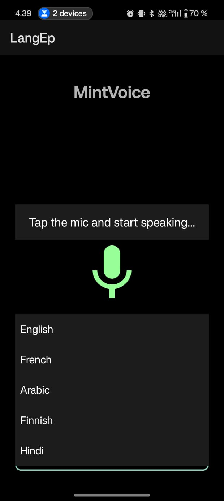
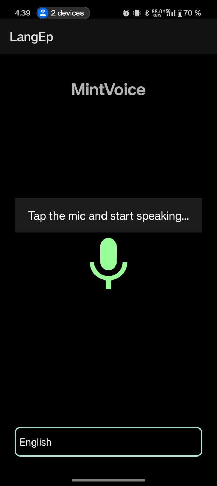
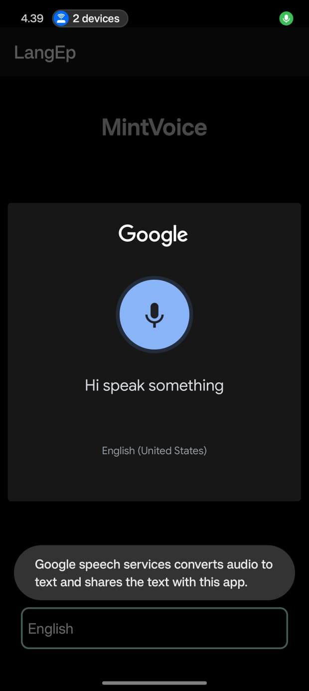

# Mint-Voice


Mint-Voice is a simple Android app that converts speech to text in multiple languages using Android's built-in `SpeechRecognizer` API. Pick a language, tap the mic, speak, and watch your words appear on screen.

## Features

- Voice-to-text using Android's `SpeechRecognizer`
- Language selection — English, French, Arabic, Finnish, Hindi
- Runtime microphone permission handling
- Instant on-screen result display
- Simple, clean UI

## Screenshots





## Requirements

- Android Studio (latest stable release recommended)
- A physical Android device with a working microphone — the emulator's virtual mic is unreliable for speech recognition
- Google app / Google Voice Input installed and enabled on the device
- Active internet connection (required by Android's speech recognition service for best accuracy)

## Getting Started

1. Clone the repository:
   ```bash
   git clone https://github.com/alia-dd/Mint-Voice.git
   ```
2. Open the project in **Android Studio**.
3. Let Gradle sync finish, then connect a physical device via USB (with USB debugging enabled) or run it directly on your phone.
4. Build and run the app.
5. Select a language from the dropdown.
6. Tap the mic button, speak, and see the transcribed text appear instantly.

## Permissions

The app requires microphone access and requests it automatically at runtime:

```xml
<uses-permission android:name="android.permission.RECORD_AUDIO"/>
```

## Tech Stack

- **Language:** Java
- **Platform:** Android SDK
- **Speech Engine:** Android `SpeechRecognizer` API
- **UI:** XML layouts

## Notes & Limitations

- Requires Google Voice Input to be available and enabled on the device.
- Language support may vary by device and Android version.
- An internet connection may be required for accurate recognition results.

## Contributing

Contributions, issues, and feature requests are welcome. Feel free to check the [issues page](https://github.com/alia-dd/Mint-Voice/issues) or open a pull request.

## License

This project is licensed under the [Apache-2.0 License](LICENSE).
